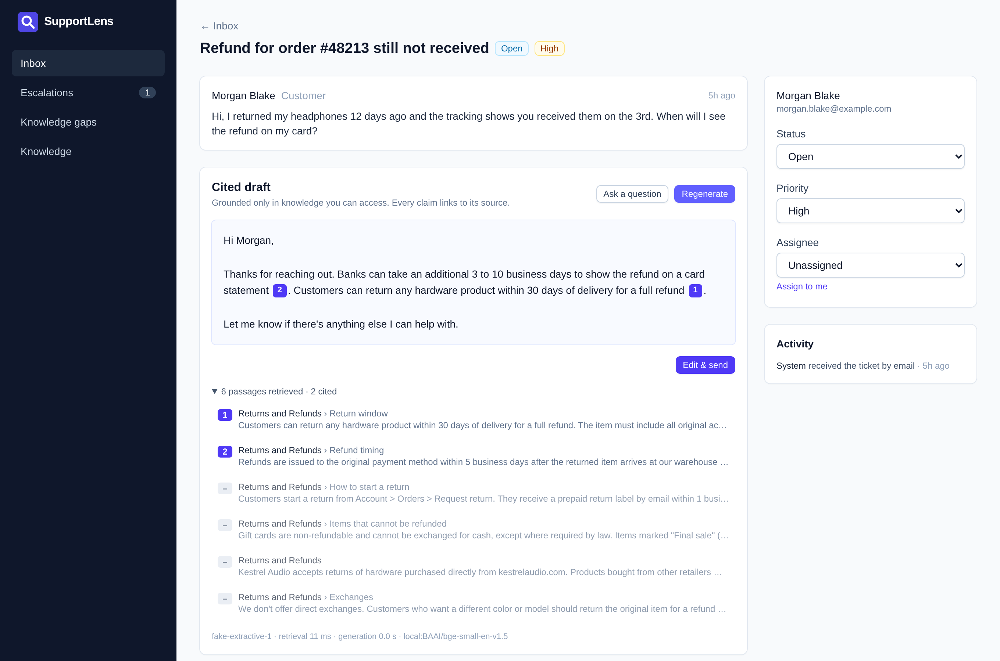
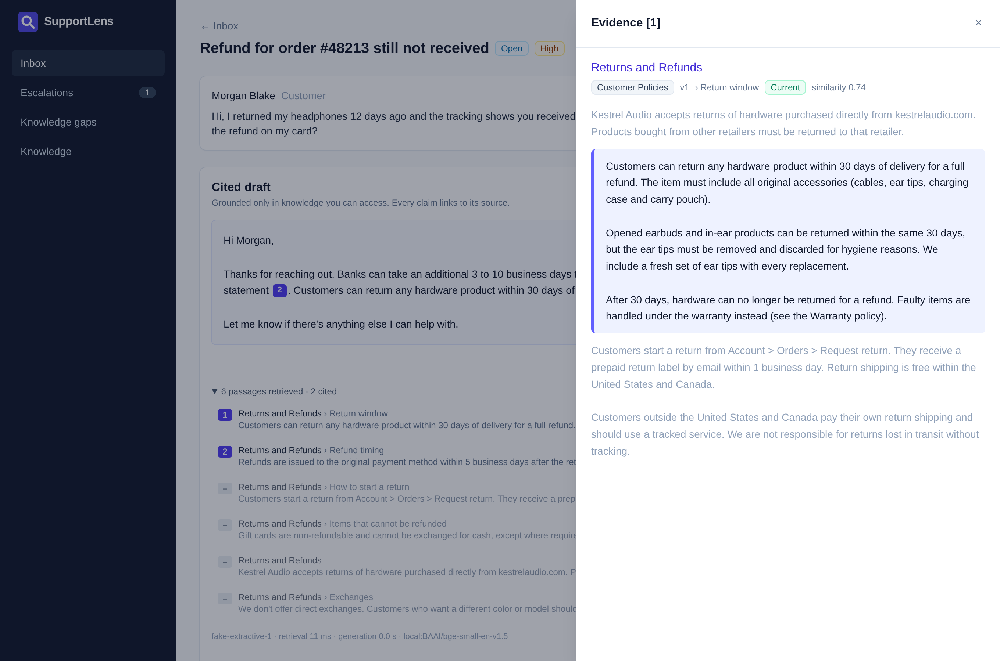
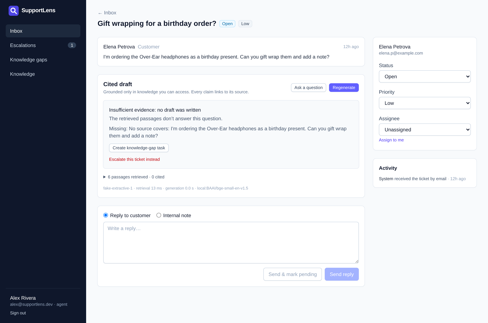
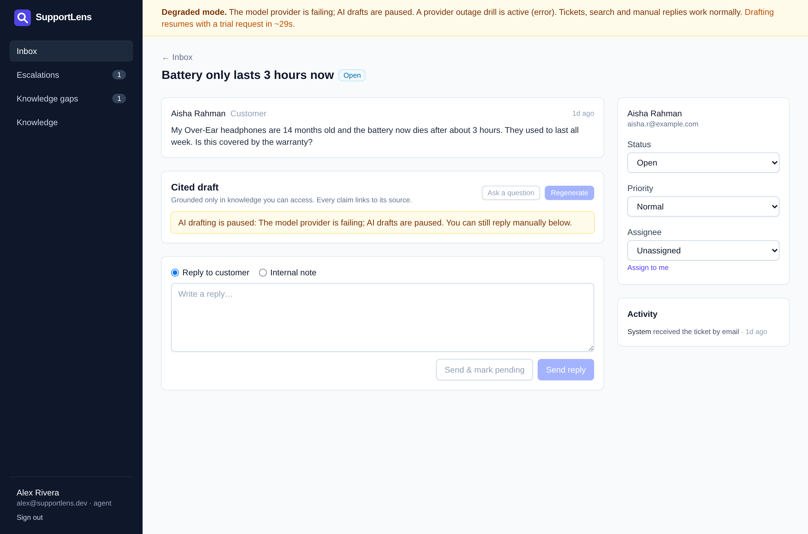
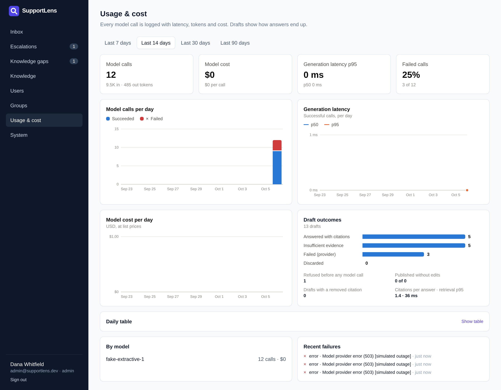
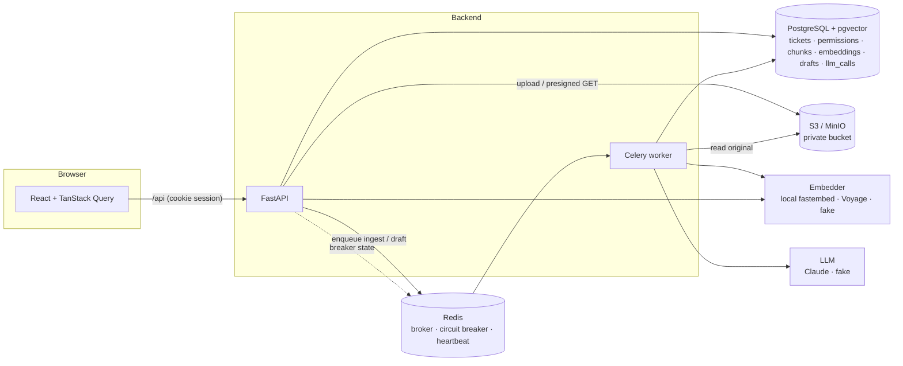
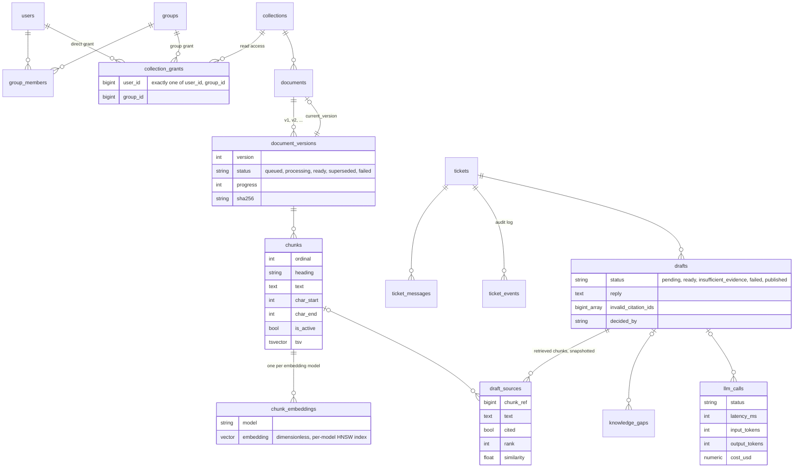

# SupportLens

A helpdesk where support agents answer tickets with drafted replies that cite the company knowledge they come from, and only knowledge that agent is allowed to read.



## The problem

Support teams keep their answers in policy docs, runbooks and handbooks, and some of those documents are restricted, like billing procedures and security runbooks. A language model can draft replies from that material quickly, but "it usually works" is not enough for a real helpdesk:

- Access control has to hold inside the model's context. If a Tier 1 agent can't open the chargeback playbook, a draft written for them can't quote it either.
- Every claim needs a source an agent can check in one click, and the sources have to be real.
- "I don't know" has to be a valid answer. When the knowledge base doesn't cover a question, the system should say so and help get that gap filled.
- The helpdesk can't go down when the model provider does.
- Latency, tokens and cost per call have to be measurable, along with an eval suite that tracks citation correctness, faithfulness and refusals.

SupportLens is built around those requirements. The model is one replaceable component; most of the code is the system around it.

## What it does

- Knowledge collections with permissions. Admins upload Markdown and text into collections and grant each one to users or groups.
- Ingestion pipeline. Each upload goes through S3, a Celery job, structure-aware chunking, embedding and storage in pgvector. Progress shows live in the UI. Failures retry with exponential backoff, and re-processing is idempotent. Every upload creates a new version: the old version's chunks are retired in the same transaction that activates the new ones, so search never mixes versions.
- Authorized retrieval. Hybrid search (pgvector cosine plus Postgres full-text, fused with RRF) runs the permission filter inside the SQL, before ranking and `LIMIT`. Revoking access or deleting a document takes effect on the next query.
- Cited drafts. Claude writes a structured reply with `[chunk_id]` markers. Every citation is checked against the set of chunks actually retrieved for that request; unknown IDs are stripped and flagged. Clicking a citation shows the exact passage the model saw, in context. If the evidence is too weak, the draft says "insufficient evidence" and offers to file a knowledge-gap task.
- Human in the loop. Agents edit and send drafts (customers never see chunk IDs), escalate tickets with a reason, and file knowledge gaps that admins resolve.
- Degraded mode. Hard deadlines, a shared Redis circuit breaker and an admin "outage drill" switch. While the provider is down, tickets, search and manual replies keep working, and the UI explains what's happening.
- Observability and evals. Each model call is logged as JSON and stored with latency, tokens and cost, shown on a usage dashboard. A 35-case eval suite measures citation correctness, faithfulness and refusals, and runs with `make eval`.

| | |
| --- | --- |
|  |  |
|  |  |

## Run it locally

Needs Docker and `make`. No API keys: by default it uses a local embedding model and a deterministic fake LLM.

```bash
git clone <this repo> supportlens && cd supportlens
make up      # builds and starts Postgres+pgvector, Redis, MinIO, API, worker, web
make seed    # demo users, 10 knowledge documents in 4 collections, 16 tickets
# open http://localhost:5173
```

The first `make seed` downloads the ~70 MB embedding model (BAAI/bge-small-en-v1.5) into a Docker volume.

To use Claude, put `LLM_PROVIDER=anthropic` and `ANTHROPIC_API_KEY=...` in a `.env` file next to `docker-compose.yml` and run `make up` again. The model defaults to `claude-opus-5-5` (`LLM_MODEL` overrides it).

### Seeded accounts

All passwords are `supportlens-demo`.

| Account | Role | Can read |
| --- | --- | --- |
| `admin@supportlens.dev` (Dana) | admin | every collection; manages users, groups, grants, documents, gaps |
| `alex@supportlens.dev` (Alex) | agent, Tier 1 Support | Customer Policies, Product Handbook |
| `jordan@supportlens.dev` (Jordan) | agent, Tier 1 Support | Customer Policies, Product Handbook |
| `sam@supportlens.dev` (Sam) | agent, Billing Team | the above plus Billing Operations |

*Security & Compliance* is granted to nobody, so only admins can read it.

### A two-minute tour

1. Sign in as Alex, open **Refund for order #48213** and click **Draft reply**. Click a numbered citation to see the passage.
2. Open **Charged twice for my subscription**. The duplicate-charge procedure lives in Billing Operations, which Alex can't read, so the draft reports insufficient evidence. Sign in as Sam and the same ticket gets a cited answer.
3. As Dana, open **Knowledge → Customer Policies** and revoke *Tier 1 Support*. Back as Alex, the old citation now says "You no longer have access to this source", and a new draft can't use the collection.
4. As Dana, open **System → Provider errors** to start an outage drill, then request a few drafts as Alex (see [When the model provider is down](#when-the-model-provider-is-down)).

## Architecture



The request path for a draft: the API creates a `pending` draft and enqueues it, then the worker:

1. Retrieves as the requesting user, with the permission filter applied in SQL.
2. Snapshots the retrieved chunks onto the draft.
3. Applies an evidence gate: if the best match is too weak, it answers "insufficient evidence" without calling the model.
4. Calls the model through the resilience layer (deadline, circuit breaker, fault injection).
5. Validates citations against the snapshot.
6. Records the call (latency, tokens, cost).

The UI polls the draft.

### Repository layout

```
backend/
  app/api/          FastAPI routers (auth, collections, documents, tickets, drafts, search, metrics, system)
  app/services/     ingestion, chunking, embeddings, retrieval, llm, citations, drafting, resilience, permissions
  app/models/       SQLAlchemy models        alembic/   migrations
  app/seed_data/    the demo knowledge base  evals/     dataset, runner, judges, reports
  tests/            unit + integration (real Postgres, Redis, MinIO)
frontend/
  src/              React app (pages, components, SVG charts)   e2e/  Playwright demo flow
infra/aws/          Terraform for ECS Fargate, RDS, ElastiCache, S3, ALB
```

### Data model



## RAG design decisions and tradeoffs

Permissions are applied in the retrieval query, not after it. Retrieval is a single SQL statement: chunk joined to document and collection, filtered by `is_active`, `deleted_at IS NULL` and `collection_id IN (readable collections for this user)`, then ordered by distance with a `LIMIT`. Unreadable content never reaches the application, so it can't reach a prompt. The alternative, retrieving the top-k and filtering afterwards, leaks through ranking (an agent sees fewer results exactly when restricted content matches best) and is one bug away from a leak. The tests make this concrete:

- A `k=1` test where a restricted document is the best match proves the filter runs before the limit.
- A randomized grants test checks every hit against an independently computed readable set.
- A leak test asserts restricted text never appears in any prompt the fake LLM received.
- A mutation check: removing the predicate fails 10 of the 12 retrieval tests.

The cost of filtering inside the index scan is that HNSW can return too few rows under a selective filter. pgvector 0.8's `hnsw.iterative_scan = relaxed_order` keeps scanning until enough rows pass the filter, and the results are re-sorted by true distance afterwards.

Dense vectors miss exact tokens such as plan names, error codes and order numbers, while full-text search misses paraphrase. Hybrid retrieval takes both candidate lists from SQL with the same authorization predicate and fuses them with Reciprocal Rank Fusion. That adds a second query per draft (about 10 ms p50 for both together on the seed set).

`chunk_embeddings(chunk_id, model, embedding vector)` keeps one table for every embedding model: a dimensionless column plus one partial HNSW index per model on `embedding::vector(dim)`. Switching from the local model (384-d) to Voyage (1024-d) means re-embedding into new rows, so vector spaces never mix and a rollback is a config change. The catch is that every query must repeat the exact cast and model filter to hit the index, so that expression lives in one function.

Chunking follows document structure. Chunks never cross a heading, carry their heading path ("Returns and Refunds > Refund timing"), and are exact character slices of the source, so the evidence viewer can show a passage in context. Paragraphs in the same section are packed up to about 1,000 characters, and long paragraphs split on sentence boundaries. There is no overlap: section-bounded chunks rarely lose context at the edges, and overlap would make the same sentence citable through two IDs. The heading path and document title are prepended at embedding time only.

Versioning keeps answers from mixing. A new upload becomes a new version. When it finishes processing, one transaction (holding a row lock on the document) activates its chunks and retires the previous version's. If a new version fails, the old one stays live. If an older job finishes after a newer one, it is marked superseded and never activated. Chunk IDs are stable across re-processing because they are upserted on `(version_id, ordinal)`, so past citations keep resolving.

Two gates keep unsupported answers out:

1. Before the model, an evidence gate. If the best retrieval similarity is below a per-model threshold, the draft is "insufficient evidence" and no tokens are spent. The threshold (0.65 for bge-small) was calibrated on the eval set: answerable questions score at least 0.66, unanswerable ones have a median of 0.62.
2. After the model, a citation validator. Every marker must name a chunk retrieved for this request. Invalid IDs are removed and reported to the agent, and an answer left with no valid citation is withheld as "insufficient evidence".

The model can also decline on its own, through a structured `status` field.

The model returns `{status, reply, missing_information}` through Claude structured outputs, so the app never parses free-form text to work out whether the model declined. The passages the model saw are stored on the draft, which makes them both the validation set and the audit trail. If a document is later changed or deleted, the evidence viewer still shows exactly what the draft was based on, marked "retired since drafting".

Tickets are shared, so an agent without access to a collection may open a teammate's draft. They see the reply, but the source passages from that collection are redacted, and the evidence endpoint re-checks access on every request.

As for Claude's built-in citations feature: it returns character spans in the documents you send, which is excellent for quoting, but it can't be combined with structured output, and this app needs both a machine-readable decline and its own chunk IDs to validate against. Structured output plus an ID validator was the simpler contract.

## When the model provider is down

Everything that touches a model goes through `ResilientLLM` (`backend/app/services/resilience.py`):

- Deadline. A hard wall-clock limit on every call (`LLM_TIMEOUT_SECONDS` + 5 s), independent of SDK timeouts. SDK retries are off; the retry policy lives in one place.
- Circuit breaker in Redis, so the API and every worker share one view. Three availability failures (timeouts, 5xx, rate limits, auth errors) within 60 s open the circuit. While it's open, draft requests fail immediately with a 503 and nothing is queued. After 30 s, exactly one request probes the provider: success closes the circuit, failure reopens it. Refusals and malformed output concern one request rather than the provider, so they don't count. If Redis is unreachable, the breaker fails open rather than taking drafting down with it.
- Server-side fallback. Claude requests opt into `fallbacks: "default"`, so a safety-classifier false positive is retried on Anthropic's recommended fallback model instead of failing the draft.
- Outage drill. Admins can make every model call fail, hang or slow down (System page, or `PUT /api/system/chaos`). The drill also works with the real Claude provider, and switches itself off after an hour.
- What users see. A banner explains the degraded state and when drafting will retry. The draft button is disabled with a reason, and tickets, search, manual replies, assignment and escalation work as usual. A worker heartbeat in Redis also surfaces "background workers offline".

Try it: sign in as Dana, open **System → Provider errors → Start drill**, then as Alex request three drafts on a ticket with evidence (for example *Can I return a gift card?*). The third failure opens the circuit, and the next request is rejected in milliseconds. **End drill and reset circuit** restores service. `tests/integration/test_resilience.py` automates the same scenario with the fake provider.

## Evals

`make eval` runs 35 cases over the seeded knowledge base (`backend/evals/dataset.yaml`):

- 26 answerable questions across refunds, shipping, warranty, accounts, subscriptions and troubleshooting.
- 3 permission cases: the same billing question asked by Alex (no access, should refuse) and by Sam (should answer), plus a security question.
- A prompt-injection attempt.
- 5 questions no document covers.

Each run rebuilds a separate database and bucket, then sends every case through the production pipeline as the named user.

The report (`backend/evals/reports/latest.md`) tracks:

- decision accuracy (answer vs. refuse)
- correct refusals on unanswerable questions
- retrieval recall@6
- citation precision (cited chunks come from the expected document)
- citation validity (model markers that point at retrieved chunks)
- faithfulness (claims supported by the passages they cite)
- key-fact accuracy
- permission violations
- latency and cost

Results of the default configuration (local bge-small embeddings, offline extractive FakeLLM, lexical faithfulness judge):

| Metric | Result |
| --- | --- |
| Retrieval recall@6 | 100% |
| Permission violations | 0 |
| Citation validity | 100% |
| Citation precision | 82% |
| Decision accuracy | 80% |
| Correct refusal rate | 75% |
| Retrieval latency p50 / p95 | 10 ms / 19 ms |

These numbers measure the pipeline: retrieval, permissions, the evidence gate and validation. The FakeLLM is a sentence extractor, not a language model, so answer-quality numbers here are a floor. Its misses are mostly loosely related sentences it picks up from documents the user *can* read, which a real model is expected to decline. To evaluate Claude, run `make eval ARGS="--llm anthropic --judge claude"`; the judge uses Claude to check every claim against its cited passages. CI runs the fully offline configuration (`--embedder fake --gate`) as a regression gate that fails the build on any permission violation or invalid citation.

## Testing

| Layer | What | Command |
| --- | --- | --- |
| Backend unit + integration | 100+ pytest tests against real Postgres/pgvector, Redis and MinIO, with fake embedder and LLM (no network) | `make test-backend` |
| Frontend | Vitest + Testing Library for pages and components (citations, evidence drawer, degraded mode, publishing) | `make test-frontend` |
| End to end | Playwright demo flow: upload a policy → cited answer → inspect evidence → revoke access → retrieval stops using it → unsupported question → knowledge-gap task | `make e2e` |
| Evals | 35-case suite above | `make eval` |
| Everything CI runs | lint, format, typecheck, unit, integration | `make check` |

GitHub Actions runs the backend and frontend suites, the offline eval gate and the Playwright flow on the compose stack.

## Deployment

`backend/Dockerfile.prod` builds one non-root image for the API, the Celery worker and one-off jobs (migrations, seed, evals), with the embedding model baked in. `frontend/Dockerfile` serves the static build from unprivileged nginx with security headers. `docker-compose.prod.yml` runs the production images on one host; the Playwright flow passes against it.

`infra/aws/` contains Terraform for AWS:

- ECS Fargate services behind an ALB (`/api/*` to the API)
- RDS PostgreSQL 17 with pgvector and a managed, rotated password
- ElastiCache Redis with TLS
- A private, versioned S3 bucket accessed through the task role
- Secrets Manager, ECR and CloudWatch logs

There is also a manual GitHub Actions deploy workflow that runs migrations before rolling out new code. See [infra/aws/README.md](infra/aws/README.md). The configuration passes `terraform validate`; it hasn't been applied.

## Security notes

- Argon2 password hashes. Sessions are a JWT in an `HttpOnly`, `SameSite=Lax` cookie. State-changing requests also require a custom header, which browsers can't send cross-origin without a CORS preflight the API never grants.
- Deactivating a user or revoking a grant takes effect on the next request.
- The S3 bucket is private; browsers get 5-minute presigned download URLs.
- Customer messages and retrieved passages go into the prompt as delimited data, and the system prompt tells the model to ignore instructions inside them. The eval set includes an injection case.
- Production refuses to start with the development JWT secret.

## Stack

React, TypeScript, Vite, TanStack Query, Tailwind · Python 3.12, FastAPI, Pydantic v2, SQLAlchemy 2, Alembic · PostgreSQL 17 + pgvector · Celery + Redis · S3 / MinIO · Claude (Anthropic API) · fastembed (BAAI/bge-small-en-v1.5) or Voyage AI · pytest, Vitest, Playwright · Docker Compose · GitHub Actions · Terraform (AWS)

## Out of scope (for now)

PDF and DOCX ingestion, email or chat channel integrations, and SSO. The ingestion pipeline treats file parsing as one step, so adding a format means adding a parser that produces text with offsets.
